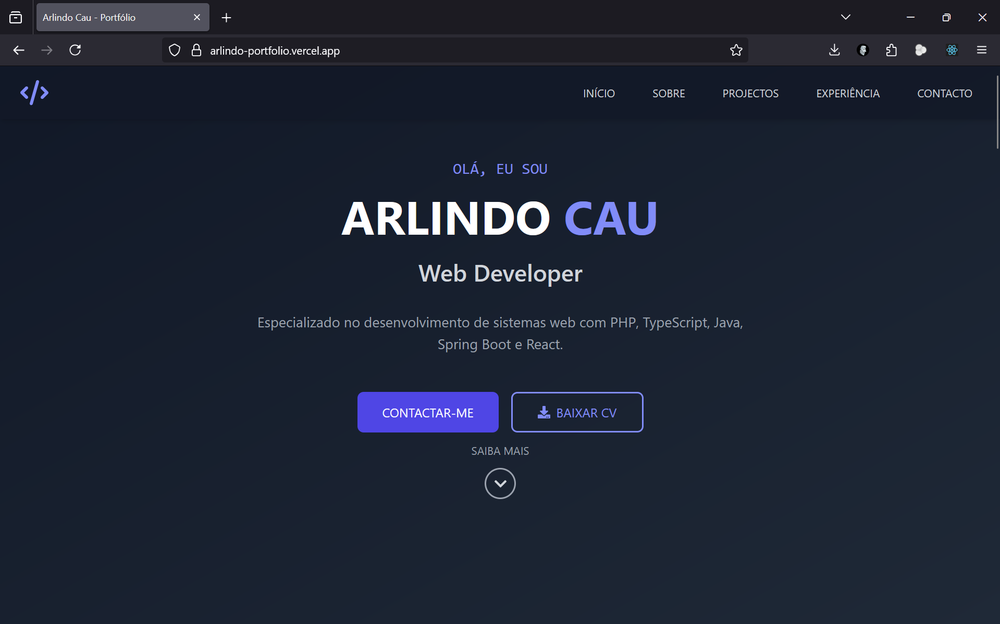

# 📌 Visão Geral

 <!-- Adicione o caminho correto para sua imagem -->

Portfólio profissional desenvolvido com React + TypeScript + Vite, apresentando minha experiência, projetos e habilidades como Engenheiro de Software Full-Stack.

## 🚀 Recursos Principais
- ✔️ Design responsivo e moderno  
- ✔️ Seção de experiências profissionais com efeito parallax  
- ✔️ Referências profissionais verificáveis  
- ✔️ Animções fluidas com Framer Motion  
- ✔️ Integração com GitHub API (em desenvolvimento)  

## 🛠️ Stack Tecnológico

  
  
  
  

## � Roadmap

### Versão 1.0 (Atual)
✅ Estrutura básica do portfólio  
✅ Seção de experiências profissionais  
✅ Referências contactáveis  

### Versão 1.1 (Próxima)
🔲 Sistema de temas (dark/light mode)  
🔲 Integração com CMS para conteúdo  
🔲 Testes automatizados (Jest + RTL)  

🛠️ Configuração do Ambiente

# Clone o repositório
git clone https://github.com/devLazarus258/arlindo-portfolio.git

# Instale as dependências
npm install

# Inicie o servidor
npm run dev

🌐 Deploy

Acesse online: https://arlindo-portfolio.vercel.app
📊 Status do Projeto

📞 Contato

Arlindo Lázaro Cau Júnior
📧 arlindolazaro202@gmail.com
📞 +258 865 304 919
